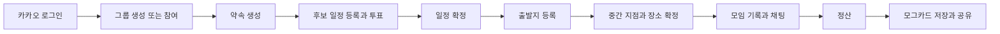

# MOG Frontend

> 약속 잡기부터 만남 기록, 정산, 추억 카드까지 한곳에서 관리하는 모임 서비스

MOG는 그룹 구성원이 가능한 일정을 투표하고, 출발지를 바탕으로 중간 지점을 정한 뒤,
모임 당일의 사진과 지출을 기록할 수 있도록 돕습니다. 기록된 내역으로 정산을 계산하고
공유 가능한 영수증 형태의 **모그카드**를 생성합니다.

## 주요 기능

- **카카오 로그인**: OAuth 인가 코드 기반 로그인과 세션 관리
- **그룹·약속 관리**: 그룹 생성/참여/초대, 약속 생성/삭제, 캘린더 조회
- **일정 조율**: 방장의 후보 등록, 참여자의 시간 투표, 최종 일정 확정
- **장소 조율**: 참여자별 출발지 등록, 카카오맵 기반 중간 지점 계산 및 장소 확정
- **모임 채팅·알림**: STOMP WebSocket 채팅과 SSE 실시간 알림
- **모임 기록**: 장소·메뉴·참여자·사진 기록, 영수증 OCR 입력 보조
- **정산**: 장소별 결제 내역과 참여 금액 조정, 개인별 송금 내역 확인
- **모그카드**: 모임 요약을 영수증 이미지로 저장하거나 Web Share API로 공유
- **컴포넌트 문서화**: Storybook과 Chromatic을 이용한 UI 확인 및 시각적 회귀 테스트

## 서비스 흐름



## 기술 스택

| 영역        | 사용 기술                                                 |
| ----------- | --------------------------------------------------------- |
| UI          | React 19, TypeScript 6, Tailwind CSS 4, Radix UI, shadcn  |
| 빌드        | Vite 8, npm                                               |
| 라우팅      | React Router 7                                            |
| 지도        | Kakao Maps JavaScript SDK                                 |
| API         | Fetch API, REST, SSE, WebSocket/STOMP                     |
| 테스트·문서 | Vitest, Playwright, Testing Library, Storybook, Chromatic |
| 품질 관리   | ESLint, Prettier, Husky, lint-staged, GitHub Actions      |
| API 모킹    | Mock Service Worker (MSW)                                 |

## 빠른 시작

### 사전 요구사항

- Node.js 20 이상 (CI는 Node.js 20 사용)
- npm

### 설치 및 실행

```bash
git clone https://github.com/goorm-mog/mog-frontend.git
cd mog-frontend
npm ci
cp .env.example .env
npm run dev
```

개발 서버는 기본적으로 `http://localhost:5173`에서 실행됩니다. `.env`에는 실행 방식에
맞는 API 주소와 카카오 키를 입력해야 합니다. 모든 설정은 [환경 설정 문서](docs/ENVIRONMENT.md)를
참고하세요.

백엔드 없이 UI와 주요 흐름을 확인하려면 `.env`에서 다음과 같이 MSW를 활성화합니다.

```dotenv
VITE_API_BASE_URL=
VITE_MSW_ENABLED=true
```

> 중간 지점 및 장소 검색 화면은 MSW 사용 여부와 관계없이 카카오맵 JavaScript 키가 필요합니다.

## 명령어

| 명령어                    | 설명                                         |
| ------------------------- | -------------------------------------------- |
| `npm run dev`             | Vite 개발 서버 실행                          |
| `npm run build`           | 타입 검사 후 프로덕션 번들 생성              |
| `npm run preview`         | 빌드 결과 로컬 미리보기                      |
| `npm run lint`            | 전체 코드 ESLint 검사                        |
| `npm test`                | Vitest/Storybook 브라우저 테스트 실행        |
| `npm run storybook`       | Storybook을 `http://localhost:6006`에서 실행 |
| `npm run build-storybook` | 정적 Storybook 빌드 생성                     |

## 프로젝트 구조

```text
src/
├── api/          # 그룹, 방, 인증, 알림, 채팅, 기록 API
├── components/   # 공통 UI와 shadcn 기반 요소
├── constants/    # 색상, 타이포그래피, 시간, 에러 메시지
├── contexts/     # 앱 전역 Context (Toast)
├── features/     # 일정, 출발지, 중간 지점, 정산 도메인 모듈
├── hooks/        # 여러 화면에서 공유하는 훅
├── lib/          # API 클라이언트, 인증 저장소, OAuth 유틸리티
├── mocks/        # MSW 핸들러, 인메모리 DB, fixture
├── pages/        # 라우트 단위 화면과 화면 전용 로직
├── routes/       # 예제/디자인 시스템 라우트
├── services/     # 외부 SDK 로더 (Kakao Maps)
├── types/        # 공용 API·도메인 타입
└── utils/        # 범용 포맷·계산 유틸리티
```

`@/` 별칭은 `src/`를 가리킵니다. 상세한 모듈 책임과 요청 흐름은
[아키텍처 문서](docs/ARCHITECTURE.md)에 정리되어 있습니다.

## 주요 라우트

| 경로                        | 설명                          |
| --------------------------- | ----------------------------- |
| `/`, `/login`               | 카카오 로그인                 |
| `/oauth/kakao`              | 카카오 OAuth 콜백             |
| `/home`                     | 그룹, 약속, 캘린더, 알림 관리 |
| `/reschedule/:role/:roomId` | 일정 후보 등록·투표·확정      |
| `/departure/:role/:roomId`  | 출발지 등록                   |
| `/midpoint/:role/:roomId`   | 중간 지점 조회·장소 확정      |
| `/:roomId/meet-detail`      | 모임 기록 및 정산 요약        |
| `/:roomId/meet-record`      | 사진, 장소, 영수증 기록       |
| `/:roomId/settlement`       | 정산 계산·조정·확정           |
| `/:roomId/mog-card`         | 모그카드 저장·공유            |
| `/:roomId/chat`             | 실시간 모임 채팅              |
| `/example/*`                | 디자인 시스템 개발용 예제     |

일정·출발지·중간 지점 화면은 `RoomGuard`가 서버의 방 단계와 사용자 역할을 확인해 올바른
경로로 이동시킵니다. URL의 `role` 값은 실제로 `host` 또는 `participant`입니다.

## 문서

- [아키텍처](docs/ARCHITECTURE.md) — 디렉터리 책임, 인증/API/실시간 통신, 방 단계 흐름
- [환경 설정](docs/ENVIRONMENT.md) — 환경 변수, 로컬 프록시, MSW, 카카오 설정
- [기여 가이드](CONTRIBUTING.md) — 브랜치, 커밋, 코드 품질, PR 체크리스트
- [PR 템플릿](.github/PULL_REQUEST_TEMPLATE.md) — 변경사항 제출 양식

## CI

`main`과 `develop` 브랜치의 push/PR에서 다음 검사가 자동 실행됩니다.

1. ESLint
2. Vitest 및 Storybook 브라우저 테스트
3. TypeScript 타입 검사
4. 프로덕션 빌드

`develop` 대상 변경은 Chromatic에서도 Storybook 시각적 변경을 확인합니다. 로컬 기여 절차는
[CONTRIBUTING.md](CONTRIBUTING.md)를 확인하세요.

## 라이선스

현재 저장소에는 라이선스가 명시되어 있지 않습니다. 사용·배포 범위는 저장소 관리자에게
문의해 주세요.
