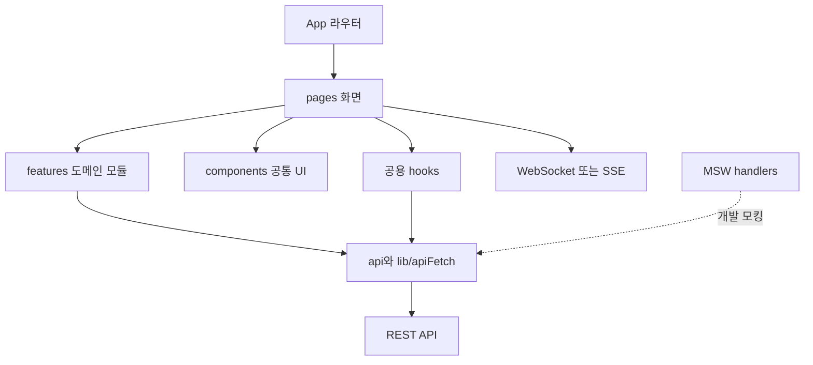

# MOG Frontend 아키텍처

이 문서는 MOG 프론트엔드의 모듈 경계와 런타임 데이터 흐름을 설명합니다. 신규 기능을 어느
위치에 추가할지 판단하거나 백엔드 연동을 추적할 때 참고하세요.

## 설계 개요

MOG는 Vite 기반 React SPA입니다. 라우트 단위 화면을 `pages`에 두고, 일정·출발지·중간 지점·
정산처럼 여러 화면에서 재사용하거나 독립적인 도메인 로직은 `features`에 둡니다. 서버 상태는
전용 API 함수와 화면/도메인 훅에서 관리하며, 별도의 전역 상태 관리 라이브러리는 사용하지
않습니다.



## 디렉터리 책임

| 경로                    | 책임                                    | 배치 기준                                  |
| ----------------------- | --------------------------------------- | ------------------------------------------ |
| `src/pages`             | 라우트 화면, 화면 전용 컴포넌트·훅·유틸 | 특정 페이지에서만 사용                     |
| `src/features`          | 도메인별 API, 타입, 훅, 컴포넌트        | 하나의 업무 기능으로 묶이며 재사용 가능    |
| `src/components/common` | 프로젝트 공통 컴포넌트                  | 두 화면 이상에서 사용하는 MOG UI           |
| `src/components/shadcn` | shadcn 기반 기본 요소                   | 외부 컴포넌트 패턴을 유지하는 UI primitive |
| `src/components/ui`     | 독립 UI 요소                            | 도메인과 무관한 작은 UI/피드백 요소        |
| `src/api`               | 상위 도메인의 REST API 함수             | 그룹·방·기록처럼 앱 전반에서 호출          |
| `src/hooks`             | 공용 React 훅                           | 둘 이상의 화면/기능에서 사용               |
| `src/lib`               | 인프라 유틸리티                         | API 요청, 인증 저장, OAuth 등              |
| `src/mocks`             | MSW 개발 서버                           | 실제 API와 같은 요청 경로의 로컬 응답      |
| `src/types`             | 공용 타입                               | 여러 도메인이 공유하는 API/엔티티 타입     |
| `src/constants`         | 공용 토큰과 상수                        | 색상, 타이포그래피, 시간, 오류 메시지      |

## 애플리케이션 진입점

1. `src/main.tsx`가 `VITE_MSW_ENABLED`를 확인합니다.
2. 모킹이 활성화되면 동적 import로 MSW worker를 시작합니다.
3. `src/App.tsx`가 `BrowserRouter`와 `ToastProvider`를 구성합니다.
4. 각 URL에 대응하는 페이지가 렌더링됩니다.

MSW를 동적으로 불러오므로 프로덕션 경로에서는 모킹 코드가 초기 실행 흐름에 포함되지
않습니다.

## 방 단계와 라우팅

약속 준비 단계는 서버의 `RoomPhase`를 기준으로 이동합니다.

| 서버 단계                    | 화면                               | 역할별 경로                                                   |
| ---------------------------- | ---------------------------------- | ------------------------------------------------------------- |
| `WAITING`, `SCHEDULE_VOTING` | 일정 등록·투표                     | `/reschedule/host/:roomId`, `/reschedule/participant/:roomId` |
| `DEPARTURE_INPUT`            | 출발지 등록                        | `/departure/host/:roomId`, `/departure/participant/:roomId`   |
| `MIDPOINT_FINDING`           | 출발지 입력 완료 후 장소 계산 준비 | 출발지 화면에서 진행                                          |
| `COMPLETED`                  | 중간 지점 및 확정 장소             | `/midpoint/host/:roomId`, `/midpoint/participant/:roomId`     |

`RoomGuard`는 다음 두 값을 함께 확인합니다.

- 서버의 현재 방 단계: `/api/rooms/:roomId/schedule/status`
- 방 구성원 중 현재 사용자의 역할: `LEADER` 또는 `MEMBER`

저장된 역할이 있으면 `sessionStorage` 값을 먼저 사용하고, 없으면 방 구성원 API로 역할을
확인합니다. 사용자는 서버가 도달한 단계까지의 이전 화면을 다시 볼 수 있지만 아직 도달하지
않은 다음 단계로 직접 접근하면 현재 단계로 돌아갑니다. URL의 역할이 실제 역할과 다를 때도
경로를 교정합니다. 탭이 다시 활성화될 때는 서버 단계를 재확인합니다.

## API 요청과 인증

대부분의 REST 요청은 `src/lib/apiFetch.ts`를 통과합니다.

- `VITE_API_BASE_URL`과 상대 API 경로를 결합합니다.
- `FormData`가 아니면 기본 `Content-Type: application/json`을 설정합니다.
- 저장된 access token을 `Authorization: Bearer ...` 헤더로 전달합니다.
- 쿠키 기반 흐름을 위해 `credentials: 'include'`를 사용합니다.
- 오류 응답을 `ApiError`로 정규화합니다.
- `401`이면 인증 세션을 지우고 `/login`으로 이동합니다.

카카오 OAuth 로그인 응답의 access token, refresh token, 사용자 식별 정보는
`sessionStorage`에 저장됩니다. 브라우저 탭이 닫히면 세션이 사라지는 구조입니다.

## 실시간 통신

### 채팅

`src/api/chat.ts`의 `MeetChatSocket`이 브라우저 WebSocket 위에서 최소 STOMP 1.2 프레임을
직접 구성합니다.

- 연결: `{WS_BASE}/ws-stomp`
- 구독: `/sub/api/v1/rooms/:roomId`
- 전송: `/pub/api/v1/rooms/:roomId/chat`
- 인증: STOMP `CONNECT` 프레임의 Bearer token

MSW 모드에서는 WebSocket 대신 REST mock 전송을 사용합니다.

### 알림

`useNotifications`는 초기 목록을 REST로 조회하고, 실제 API 모드에서는 EventSource로 새 알림을
구독합니다.

- 구독: `/api/v1/notifications/subscribe?token=...`
- 이벤트 이름: `notification`
- 중복 방지: 이미 본 `notificationId`를 메모리에 유지

SSE는 브라우저 `EventSource`의 헤더 제약 때문에 token query parameter를 사용합니다. 서버 로그와
프록시에서 해당 URL을 다룰 때 토큰 노출에 주의해야 합니다.

## 상태 관리

- **서버 상태**: 페이지/기능 훅에서 fetch 후 지역 상태로 보관
- **인증·역할**: `sessionStorage`
- **임시 편집 데이터**: 화면 상태 또는 기능별 storage utility
- **전역 UI 피드백**: `ToastContext`
- **개발용 API 상태**: `src/mocks/db`의 인메모리 데이터

새 전역 상태를 추가하기 전에 라우트 내부 지역 상태나 도메인 훅으로 해결할 수 있는지 먼저
확인하세요.

## UI와 스타일

- Tailwind CSS utility class를 기본 스타일 방식으로 사용합니다.
- 색상·타이포그래피 토큰은 `src/constants`에 정의합니다.
- 모바일 우선 레이아웃이며 주요 화면 너비는 최대 `430px`입니다.
- 재사용 UI는 Storybook story를 함께 작성하는 것을 권장합니다.
- `@/` 경로 별칭은 `src/`를 가리킵니다.

## 테스트와 모킹

Storybook story는 Vitest의 Storybook 프로젝트와 Playwright Chromium에서 실행됩니다. 현재 테스트
명령은 일반 unit test와 Storybook 브라우저 테스트를 함께 탐색합니다.

MSW 계층은 다음과 같이 구성됩니다.

```text
src/mocks/
├── browser.ts       # 브라우저 worker
├── handlers/        # API 경로별 요청 처리
├── db/              # 기능별 인메모리 상태
└── fixtures/        # 공용 응답 데이터와 오류 fixture
```

새 API를 연동할 때 실제 API 함수와 동일한 URL·메서드를 사용하는 MSW handler를 추가하면 백엔드
없이도 화면 흐름을 검증할 수 있습니다.

## 기능 추가 기준

1. 공용 API/응답 타입이 필요한지 확인합니다.
2. 단일 화면 기능이면 `pages/<PageName>` 아래에 구현합니다.
3. 독립 도메인이거나 여러 화면이 공유하면 `features/<domain>`에 구현합니다.
4. 네트워크 호출은 컴포넌트에서 분리해 `api` 모듈에 둡니다.
5. 공통 UI 토큰과 기존 컴포넌트를 우선 사용합니다.
6. API가 추가되면 MSW handler와 fixture도 함께 갱신합니다.
7. 공통 컴포넌트 변경에는 Storybook 상태와 접근성 동작을 확인합니다.
